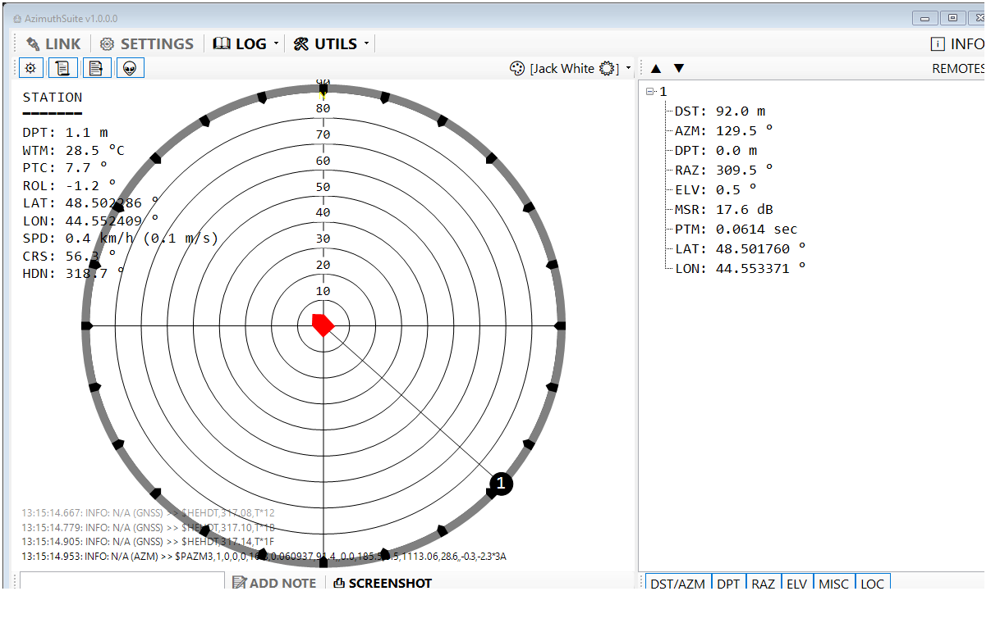

# 🐙 AzimuthSuite 

Current version: **1.5.5.5**

Host application for [Zima2 USBL system](https://docs.unavlab.com/navigation_and_tracking_systems_ru.html#zima2)

## Currently supported interface languages
- 🇨🇳
- 🇷🇺
- 🇬🇧
- 🇹🇷
- 🇰🇵, 🇰🇷

Please report any translation errors in [issues](https://github.com/ucnl/AzimuthSuite/issues)
